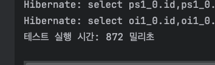

# 동시성 제어 방식 보고서

## 나의 시나리오에서 동시성 이슈가 발생 할 수 있는 로직

### 1. 유저 잔액 충전

- 유저가 잔액을 충전할 때 여러 가지 이유로 여러번 요청을 보낼 때, 최초 요청만 성공 하고 <br>
나머지 요청은 실패해야 한다.

`생길 수 있는 이슈`

- 잔액 충전 화면에서 여러 개의 창을 띄워두고 동시에 충전 요청을 할 시 동시성 처리가 되지 않는다면
요청 횟수만큼 포인트가 충전 된다. 사용자는 500원 결제 한번으로 10번 동시에 요청을 하면
5000원이 충전된다.

`해결 방법`

- 동시에 포인트 충전 요청 시 최초 1회만 성공하고 나머지 요청은 실패하는 동시성 처리를
구현 해서 10번이든 100번이든 500원 충전 요청에 대한건 1번만 완료 돼야 합니다.

### 2. 재고 차감

- 재고가 50개 있을 때 100개의 주문이 들어온다면 50개의 요청만 성공하고 나머지 50개의
요청은 실패해야 한다.

`생길 수 있는 이슈`

- 재고가 없는데 요청이 들어와서 주문이 되는 경우 이슈가 발생 할 수 있다.

`해결 방안`

- 백번, 천번, 수억번의 요청이 와도 주문은 항상 재고 수 만큼 주문이 돼야 합니다.

---
## 기존 동시성 제어 로직

### 1. 유저 잔액 충전

```kotlin
@Service
class BalanceFacade(
    private val userRepository: UserRepository,
    private val balanceService: BalanceService,
    private val balanceHistoryRepository: BalanceHistoryRepository,
) {

    @Transactional
    fun charge(balanceChargeDto: BalanceChargeDto): UserBalanceDto {

        if (balanceChargeDto.amount < 0) {
            throw BusinessException.BadRequest(ErrorCode.Balance.BAD_REQUEST_BALANCE)
        }

        val user = userRepository.findById(balanceChargeDto.userId)
            ?: throw BusinessException.NotFound(ErrorCode.User.NOT_FOUND_USER)

        val userBalanceDto = balanceService.updateCharge(balanceChargeDto, user)

        val balanceHistory = BalanceHistory(
            balanceId = userBalanceDto.balanceId,
            changeAmount = balanceChargeDto.amount,
            changeType = "SAVE",
            balanceAfter = userBalanceDto.currentAmount,
            description = "잔액 충전"
        )
        balanceHistoryRepository.save(balanceHistory)

        return userBalanceDto
    }
}

@Service
class BalanceService(
    private val balanceRepository: BalanceRepository,
) {

    fun updateCharge(balanceChargeDto: BalanceChargeDto, user: User): UserBalanceDto {

        val balance = balanceRepository.findByUserIdWithLock(balanceChargeDto.userId)?.apply {
            updateAmount(balanceChargeDto.amount)
        } ?: balanceRepository.save(
            Balance(
                user = user,
                amount = balanceChargeDto.amount,
            )
        )

        return UserBalanceDto.from(balance)
    }
}
```
`이전의 로직`

1. BalanceFacade Class

   - 충전 요청이 왔을 때 포인트나, 유저 ID 에 대한 검증을 진행 한다.
   - 검증이 완료 되면 실제 잔액 충전 비즈니스 로직이 구현 되어 있는 BalanceService
   Class 를 호출 한다.


2. BalanceService Class

    - updateCharge 에서 사용자 포인트를 충전 한다.
    - 비관적 락이 설정 되어 있다.

`이전 방식의 문제점`

동시 충전 요청에 대해 순차적으로 처리하는 방식으로 구현을 하였다. <br>

생각해보면 실제 포인트를 충전 할 때 동시에 요청이 가는 경우는 창을 여러 개 띄우고 동시에 
요청하는 경우 또는 네트워크나 기타 문제로 새로 고침을 해서 동시에 요청을 보내는 경우다.

이런 경우 요청을 순차적으로 처리하는게 아닌 첫 번째 충전 요청에 대해서만 성공 해야 한다.
그래야만 사용자는 500원 한 번만 결제를 했는데 동시에 10번 요청 했다고 5000원을 지급 하는 일이 안 생긴다.

### 2. 재고 차감
```kotlin
@Service
class OrderFacade(
    private val productStockService: ProductStockService,
    private val balanceService: BalanceService,
    private val orderService: OrderService,
) {

    @Transactional
    fun saveOrder(orderSaveDto: OrderSaveDto): OrderSaveResultDto {
        // 상품 존재 하는지 조회
        val orderProducts = productStockService.valid(orderSaveDto.products)

        // 유저 조회 - 유저 잔액 검증
        val userBalance = balanceService.getUserBalance(orderSaveDto.userId)
        userBalance.isEnoughMoney(orderSaveDto.totalAmount)

        // 주문 정보 저장
        val result = orderService.save(orderSaveDto)

        // 재고 정보 업데이트
        productStockService.updateStock(orderSaveDto.products)

        return result
    }
}

@Service
class ProductStockService(
    private val productStockRepository: ProductStockRepository
) {

    fun valid(productOrders: List<ProductOrderDto>): List<ProductOrderDto> {
        productOrders.forEach { productOrder ->
            val productStock = productStockRepository.findByIdWithLock(productOrder.productStockId)
                ?: throw BusinessException.NotFound(ErrorCode.Product.NOT_FOUND_PRODUCT)

            if (productStock.quantity < productOrder.quantity) {
                throw BusinessException.BadRequest(ErrorCode.Product.OUT_OF_STOCK)
            }
        }

        return productOrders
    }
}
```
`이전의 로직`

1. OrderFacade Class

    - 주문 요청이 왔을 때 요청에 대한 제품의 재고나 상품이 있는지 검증하기 위해 <br>
      ProductStockService.valid 를 호출 하여 검증 한다.


2. ProductStockService Class

    - valid 안에서 존재 하는 상품에 대해 비관적 락을 설정 하고 상품의 재고가 <br>
   주문 한 수량만큼 존재 하는지 검증 한다.


`이전 방식의 문제점`

ProductStockService Class 에서 요청 값에 대해 forEach 수행 하면서
Row 1줄씩 비관적 락을 설정 하고 있는데, 코드의 가독성이 떨어진다고 생각 한다.

락을 걸 때 쿼리에서 In 으로 해당 상품의 ID 로우에 한 번에 락을 거는 방식으로 수정 한다면 
코드 가독성에 도움이 될 꺼 같다.
---

## DB Lock 적용

### 낙관적 락 (Optimistic Lock)

- 동시에 공유 자원 접근이 적게 발생한다는 가정 하에 동작 한다.
- 유저 포인트 충전에 대해 낙관적 락을 적용 시켜 봤다.

`코드 구현`

```kotlin
@Service
class BalanceFacade(
   private val userRepository: UserRepository,
   private val balanceService: BalanceService,
   private val balanceHistoryRepository: BalanceHistoryRepository,
) {

   @Transactional
   fun charge(balanceChargeDto: BalanceChargeDto): UserBalanceDto {

      if (balanceChargeDto.amount < 0) {
         throw BusinessException.BadRequest(ErrorCode.Balance.BAD_REQUEST_BALANCE)
      }

      val user = userRepository.findById(balanceChargeDto.userId)
         ?: throw BusinessException.NotFound(ErrorCode.User.NOT_FOUND_USER)

      return kotlin.runCatching {
         val userBalanceDto = balanceService.updateCharge(balanceChargeDto, user)

         val balanceHistory = BalanceHistory(
            balanceId = userBalanceDto.balanceId,
            changeAmount = balanceChargeDto.amount,
            changeType = "SAVE",
            balanceAfter = userBalanceDto.currentAmount,
            description = "잔액 충전"
         )
         balanceHistoryRepository.save(balanceHistory)
         userBalanceDto
      }.getOrElse { exception ->
         when (exception) {
            is ObjectOptimisticLockingFailureException, is DataIntegrityViolationException ->
               throw BusinessException.BadRequest(ErrorCode.Balance.ALREADY_CHARGED)
            else -> throw exception
         }
      }
   }
}

@Service
class BalanceService(
   private val balanceRepository: BalanceRepository,
) {

   fun updateCharge(balanceChargeDto: BalanceChargeDto, user: User): UserBalanceDto {

      val balance = balanceRepository.findByUserIdWithLock(balanceChargeDto.userId)?.apply {
         updateAmount(balanceChargeDto.amount)
      } ?: balanceRepository.save(
         Balance(
            user = user,
            amount = balanceChargeDto.amount,
         )
      )

      return UserBalanceDto.from(balance)
   }
}

interface BalanceJpaRepository: JpaRepository<Balance, Long> {

   @Lock(LockModeType.OPTIMISTIC)
   @Query("select b from Balance b where b.user.id = :userId")
   fun findByUserIdWithLock(userId: Long): Balance?
   
}

```

`코드 설명`

1. BalanceFacade Class
   - `kotlin.runCatching` 사용 하여 예외 처리를 구현 하였다.
   - 낙관전 락 실패를 캐치하여 비즈니스 예외를 발생 시킨다.
2. BalanceService Class
   - 낙관적 락 설정
3. Balance Class
   - `@Version` 어노테이션을 통해 낙관적 락의 버전을 관리하는 필드 생성

`테스트 코드`

```kotlin
@Test
@DisplayName("잔액 충전 동시성 테스트 - 동시에 500원 충전이 10번 들어와도 충전은 한번만 완료 되어야 한다.")
fun chargeIntegrationTest() {

   // given
   val user = UserStub.create("Lee")
   val saveUser = userRepository.save(user)

   val balance = BalanceStub.create(saveUser, 500)
   balanceRepository.save(balance)

   val executor = Executors.newFixedThreadPool(10)
   val latch = CountDownLatch(10)
   val results = Collections.synchronizedList(mutableListOf<Result<UserBalanceDto>>())

   // when
   try {
      repeat(10) {
         executor.submit {
            try {
               val balanceChargeDto = BalanceChargeDto(
                  userId = saveUser.id,
                  amount = 500
               )

               val result = kotlin.runCatching {
                  balanceFacade.charge(balanceChargeDto)
               }
               results.add(result)
            } finally {
               latch.countDown()
            }
         }
      }
   } finally {
      executor.shutdown()
   }
   latch.await()

   // then
   val successCount = results.count{ it.isSuccess }
   val failCount = results.count{ it.isFailure }

   assertThat(successCount).isEqualTo(1)
   assertThat(failCount).isEqualTo(9)

   val resultUserBalance = balanceService.getUserBalance(saveUser.id)
   assertThat(resultUserBalance.currentAmount).isEqualTo(1000)

}
```

`설명`
- 10개 스레드로 동시에 500원 충전을 10번 요청 한다.
- 최종 테스트 결과는 1000원을 가지고 있어야 한다.
- 10개의 스레드에 대한 테스트는 성공 한다.

`테스트 코드 10번 실행에서 100번 수행으로 변경 후 테스트 결과`

```kotlin
org.opentest4j.AssertionFailedError: 
expected: 1
 but was: 24
Expected :1
Actual   :24
<Click to see difference>
```

`한계`

- 스레드를 10개만 생성해서 테스트를 하면 문제 없이 통과 한다.
- 스레드 갯수를 100개로 설정하고 테스트를 진행 하니 20 ~25 번 성공하는 케이스가 나온다.
- 낙관적 락은 공유 자원에 대한 접근이 적다고 가정하고 사용하는 Lock 이기 때문에
공유 자원에 대한 접근이 많아지면 데이터 정합성을 보장해 주지 않는 것을 확인하였다.

### 비관적 락 (Pessimistic Lock)

- 낙관적 락과 반대로 공유 자원에 대한 접근이 많음 가정하고 데이터를 읽는 시점에 락을 걸어 다른 트랜잭션의 접근을 차단한다.
- 상품 주문 시 비관적 락을 적용했다.

`코드 구현`

```kotlin
@Service
class OrderFacade(
   private val productStockService: ProductStockService,
   private val balanceService: BalanceService,
   private val orderService: OrderService,
) {

   @Transactional
   fun saveOrder(orderSaveDto: OrderSaveDto): OrderSaveResultDto {
      // 상품 존재 하는지 조회
      val orderProducts = productStockService.valid(orderSaveDto.products)

      // 유저 조회 - 유저 잔액 검증
      val userBalance = balanceService.getUserBalance(orderSaveDto.userId)
      userBalance.isEnoughMoney(orderSaveDto.totalAmount)

      // 주문 정보 저장
      val result = orderService.save(orderSaveDto)

      // 재고 정보 업데이트
      productStockService.updateStock(orderSaveDto.products)

      return result
   }
}

@Service
class ProductStockService(
   private val productStockRepository: ProductStockRepository
) {

   fun valid(productOrders: List<ProductOrderDto>): List<ProductOrderDto> {

      val productStockIds = productOrders.map { it -> it.productStockId }

      val existingIds = productStockRepository.findExistingIds(productStockIds)
      if (productStockIds.size != existingIds.size) {
         throw BusinessException.NotFound(ErrorCode.Product.NOT_FOUND_PRODUCT)
      }

      val productStocks = productStockRepository.findByIdsWithLock(productStockIds)
         .associateBy { it.productId }

      productOrders.forEach { productOrder ->
         val productStock = productStocks[productOrder.productStockId]
            ?: throw BusinessException.NotFound(ErrorCode.Product.NOT_FOUND_PRODUCT)

         if (productStock.quantity < productOrder.quantity) {
            throw BusinessException.BadRequest(ErrorCode.Product.OUT_OF_STOCK)
         }
      }

      return productOrders
   }

   fun updateStock(productOrders: List<ProductOrderDto>): List<ProductOrderDto> {

      val productStocksToUpdate: List<ProductStock> = productOrders.map { productOrder ->
         val productStock = productStockRepository.findById(productOrder.productStockId)
            ?: throw BusinessException.NotFound(ErrorCode.Product.NOT_FOUND_PRODUCT)

         // 주문 수량만큼 재고 차감
         val updatedQuantity = productStock.quantity - productOrder.quantity

         // 수량 업데이트
         productStock.updateQuantity(updatedQuantity)
         productStock
      }

      // 변경된 재고 정보 저장
      productStockRepository.saveAll(productStocksToUpdate)

      return productOrders
   }
}
```

`코드 설명`

1. OrderFacade Class
   - `kotlin.runCatching` 사용 하여 예외 처리를 구현 하였다.
   - 비관적 락 실패를 캐치하여 비즈니스 예외를 발생 시킨다.
2. ProductStockService Class
   - 비관적 락 설정

`테스트 코드`

```kotlin
 @Test
 @DisplayName("주문 동시성 통합 테스트 - 재고가 50개 있을 때 100번 요청 후 성공 50, 실패 50 검증 테스트")
 fun saveIntegrationTest() {
     val startTime = System.nanoTime()
     
     val user = UserStub.create("lee")
     val saveUser = userRepository.save(user)

     val balance = BalanceStub.create(user = saveUser, amount = 1000000)
     val userBalance = balanceRepository.save(balance)

     val product = ProductStub.create("aidas", "SHOES", 1)
     val saveProduct = productRepository.save(product)

     val productStock = ProductStock(
         productId = saveProduct.id,
         size = "270",
         quantity = 50,
     )
     val saveProductStock = productStockRepository.save(productStock)

     val executor = Executors.newFixedThreadPool(100)
     val lectureLatch = CountDownLatch(100)
     val successCnt = AtomicInteger(0)
     val failCnt = AtomicInteger(0)

     // when && then
     try {
         repeat(100) {
             executor.submit {
                 try {
                     val orderSaveDto = OrderSaveDto(
                         userId = saveUser.id,
                         totalAmount = 1,
                         products = listOf(
                             ProductOrderDto(
                                 productStockId = saveProductStock.id!!,
                                 quantity = 1 // 각 주문에 1씩 요청
                             )
                         )
                     )

                     val saveResult = orderFacade.saveOrder(orderSaveDto)
                     successCnt.incrementAndGet()
                 } catch (ex: BusinessException) {
                     failCnt.incrementAndGet()
                 } finally {
                     lectureLatch.countDown()
                 }
             }
         }
         lectureLatch.await()

         assertThat(successCnt.get()).isEqualTo(50)

         val successResults = orderItemRepository.findByProductStockId(saveProductStock.id!!)
         assertThat(successResults.size).isEqualTo(50)
         assertThat(failCnt.get()).isEqualTo(50)

     } finally {
         executor.shutdown()
     }
     val endTime = System.nanoTime()
     val duration = Duration.ofNanos(endTime - startTime)

     println("테스트 실행 시간: ${duration.toMillis()} 밀리초")
 }
```

`테스트 코드 설명`
- 재고가 50개 있는 상품에 대해 100번의 요청을 해봤다.
- 정상적으로 50번의 성공과 실패가 일어난다.


- 그렇다면 1000번의 요청을 해봤을 때도 데이터 정합성을 보장할까? <br>

- 시간이 좀 더 걸릴 뿐 낙관적 락과 다르게 요청 횟수가 증가해도 보장한다.

`결과 및 분석`

- 비관적 락은 데이터 정합성은 보장하지만, 전체적인 처리 속도는 저하 될 수 있다.
- 데이터베이스 수준의 락이기 때문에 분산 환경에서의 확장성에 제한이 있다.

## 분산 락 적용
- 분산 락은 여러 서버에서 동시에 접근하는 공유 자원에 동시성을 제어하기 위해 사용한다.
- Redis를 이용해 커스텀 어노테이션과 함께 AOP를 통해 구현했다.

`Spimple Lock 코드 구현`

```kotlin
@Component
class RedisSimpleLock(
    val redisTemplate: RedisTemplate<String, String>,
) {

    fun tryLock(
        key: String,
        value: String,
        leaseTime: Long,
        timeUnit: TimeUnit,
    ): Boolean {
        return redisTemplate.opsForValue().setIfAbsent(key, value, leaseTime, timeUnit) ?: false
    }

    fun releaseLock(
        key: String,
        value: String,
    ): Boolean {

        val ops = redisTemplate.opsForValue()
        val lockValue = ops.get(key)

        if (lockValue == null) {
            redisTemplate.delete(key)
            return true
        }

        return false
    }

}

@Aspect
@Component
class DistributedSimpleLockAspect(
   private val redisSimpleLock: RedisSimpleLock,
) {

   @Around("@annotation(com.hhplus.e_commerce.common.annotation.DistributedSimpleLock)")
   fun around(joinPoint: ProceedingJoinPoint): Any? {
      val signature = joinPoint.signature as MethodSignature
      val method = signature.method
      val distributedSimpleLock = method.getAnnotation(DistributedSimpleLock::class.java)

      val lockKey = distributedSimpleLock.key
      val lockValue = UUID.randomUUID().toString()

      try {
         val acquired = redisSimpleLock.tryLock(
            key = lockKey,
            value = lockValue,
            leaseTime = distributedSimpleLock.leaseTime,
            timeUnit = distributedSimpleLock.timeUnit
         )

         if (!acquired) {
            throw BusinessException.BadRequest(ErrorCode.Common.BAD_REQUEST)
         }

         return joinPoint.proceed()
      } finally {
         redisSimpleLock.releaseLock(lockKey, lockValue)
      }
   }

}

@Target(AnnotationTarget.FUNCTION)
@Retention(AnnotationRetention.RUNTIME)
annotation class DistributedSimpleLock(
   val key: String,
   val waitTime: Long = 5,
   val leaseTime: Long = 10,
   val timeUnit: TimeUnit = TimeUnit.SECONDS,
)

@Service
class BalanceLockFacade(
   private val balanceFacade: BalanceFacade
) {

   @DistributedSimpleLock(
      key = "'userId:' + #{balanceChargeDto.userId}",
      waitTime = 5,
      leaseTime = 10,
   )
   fun charge(balanceChargeDto: BalanceChargeDto): UserBalanceDto {
      if (balanceChargeDto.amount < 0) {
         throw BusinessException.BadRequest(ErrorCode.Balance.BAD_REQUEST_BALANCE)
      }

      return balanceFacade.charge(balanceChargeDto)
   }
}
```

`코드 설명`

1. RedisSimpleLock Class
   - Redis를 사용하여 분산 락을 제공하는 클래스
2. DistributedSimpleLockAspect Class
   - around: `@DistributedSimpleLock` 어노테이션이 붙은 메서드를 감싸며,
   락을 시도하고, 락을 획득하면 메서드를 실행합니다. 메서드 실행 후 락을 해제합니다.
3. DistributedSimpleLock Class
   - 분산 락을 사용할 메서드에 붙이는 커스텀 어노테이션
4. BalanceLockFacade Class
   - 기존 Controller -> facade -> service -> repo 단계에서 
   락 -> 트랜잭션 시작 -> 트랜잭션 종료 -> 언락 구조를 가져가기 위해 레이어 하나를 더 추가 했습니다.

`수행 결과`


- 이전에 낙관적 락을 적용했을 때 100번 요청하면 실패
- 분산락을 적용 후 1000번 요청해도 안정적으로 실행 되는 것을 확인.

`Spin Lock 코드 구현`

```kotlin
@Aspect
@Component
class DistributedSpinLockAspect(
    private val redisTemplate: RedisTemplate<String, String>,
) {

    @Around("@annotation(com.hhplus.e_commerce.common.annotation.DistributedSpinLock)")
    fun around(
        joinPoint: ProceedingJoinPoint,
        distributedSpinLock: DistributedSpinLock,
    ): Any? {

        val key = distributedSpinLock.key
        val startTime = System.currentTimeMillis()
        val endTime = startTime + distributedSpinLock.timeUnit.toMillis(distributedSpinLock.waitTime)

        while (System.currentTimeMillis() < endTime) {
            val lockAcquired =
                redisTemplate
                    .opsForValue()
                    .setIfAbsent(key, "locked", distributedSpinLock.leaseTime, distributedSpinLock.timeUnit)

            if (lockAcquired == true) {
                try {
                    return joinPoint.proceed()
                } finally {
                    redisTemplate.delete(key)
                }
            }

            Thread.sleep(distributedSpinLock.spinTime)
        }

        throw BusinessException.BadRequest(ErrorCode.Common.BAD_REQUEST)
    }

}

@Target(AnnotationTarget.FUNCTION)
@Retention(AnnotationRetention.RUNTIME)
annotation class DistributedSpinLock(
   val key: String,
   val waitTime: Long = 30, // 전체 대기 시간
   val spinTime: Long = 100, // 각 시도 사이의 대기 시간 (밀리초)
   val leaseTime: Long = 10,
   val timeUnit: TimeUnit = TimeUnit.SECONDS,
)
```
`코드 설명`

1. DistributedSpinLockAspect Class
   - around: `@DistributedSpinLock` 어노테이션이 붙은 메서드를 감싸며,
     락을 시도하고, 락을 획득하면 메서드를 실행합니다. 메서드 실행 후 락을 해제합니다.
   - System.currentTimeMillis() < endTime 조건을 통해 락 획득해서 반납하는 총 시간이
   현재 시간 보다 작으면 다시 락을 얻으려고 요청 한다.
2. DistributedSpinLock Class
   - 분산 락을 사용할 메서드에 붙이는 커스텀 어노테이션

`구현 결과`

- Spin Lock 은 Simple Lock 과 마찬 가지로 잔액 충전 포인트에 적용 했다. 이번 e-commerce
시나리오에서 Simple-Lock, Spin-Lock 을 처리하는 부분은 잔액 충전 부분 밖에 없다고 생각한다.
- 동시에 100개의 주문이 왔을 때 재고 처리를 하는 Order 의 비즈니스 로직의 경우 데이터 정합성이 중요하고 <br>
재고가 없다고 해서 재요청을 할 필요가 없다. 재고가 없을 때 요청은 그냥 실패다. 그래서 이번 분산락을 구현하고 <br>
주문하는 비즈니스 로직에는 추가를 하지 않았다.

### 최종 결론

1. `잔액 충전`
   - 잔액 동시 충전 요청에 대해서는 DB 레벨에 Lock을 설정하는게 아닌 분산 환경에서 처리 가능하도록 
   분산락을 적용합니다. 분산락 중 Simple-Lock 설정을 통해 동시성을 보장 할 수 있습니다.
2. `주문 요청`
   - 주문 요청에 대해서는 분산락의 Simple-Lock, Spin-Lock이 아닌 redis pub/sub 구조를 적용 할 예정입니다.
   왜냐하면 메시징 큐와 유사한 구조를 쉽게 사용할 있습니다. 주문 요청과 같이 순차적인 처리가 필요한 작업에 효과적이며, 
   특히 주문 처리량이 증가해도 확장성 있는 처리가 가능합니다.


