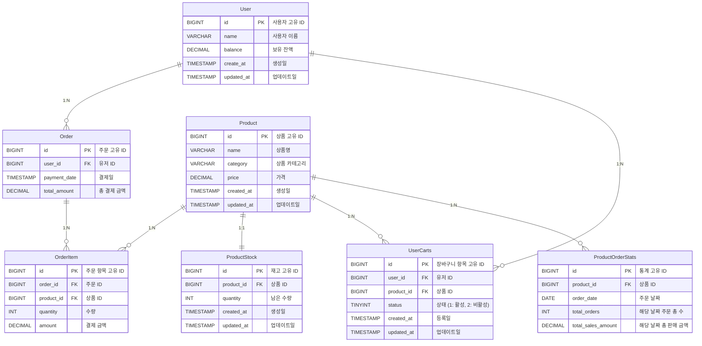

```mermaid
erDiagram

    User ||--o{ Order : "1:N"
    User ||--o{ UserCarts : "1:N"
    Product ||--o{ OrderItem : "1:N"
    Product ||--|| ProductStock : "1:1"
    Product ||--o{ UserCarts : "1:N"
    Product ||--o{ ProductOrderStats : "1:N"
    Order ||--o{ OrderItem : "1:N"
    
    User {
        BIGINT id PK "사용자 고유 ID"
        VARCHAR name "사용자 이름"
        DECIMAL balance "보유 잔액"
        TIMESTAMP create_at "생성일"
        TIMESTAMP updated_at "업데이트일"
    }

    Product {
        BIGINT id PK "상품 고유 ID"
        VARCHAR name "상품명"
        VARCHAR category "상품 카테고리"
        DECIMAL price "가격"
        TIMESTAMP created_at "생성일"
        TIMESTAMP updated_at "업데이트일"
    }

    ProductStock {
        BIGINT id PK "재고 고유 ID"
        BIGINT product_id FK "상품 ID"
        INT quantity "남은 수량"
        TIMESTAMP created_at "생성일"
        TIMESTAMP updated_at "업데이트일"
    }

    Order {
        BIGINT id PK "주문 고유 ID"
        BIGINT user_id FK "유저 ID"
        TIMESTAMP payment_date "결제일"
        DECIMAL total_amount "총 결제 금액"
    }

    OrderItem {
        BIGINT id PK "주문 항목 고유 ID"
        BIGINT order_id FK "주문 ID"
        BIGINT product_id FK "상품 ID"
        INT quantity "수량"
        DECIMAL amount "결제 금액"
    }

    ProductOrderStats {
        BIGINT id PK "통계 고유 ID"
        BIGINT product_id FK "상품 ID"
        DATE order_date "주문 날짜"
        INT total_orders "해당 날짜 주문 총 수"
        DECIMAL total_sales_amount "해당 날짜 총 판매 금액"
    }

    UserCarts {
        BIGINT id PK "장바구니 항목 고유 ID"
        BIGINT user_id FK "유저 ID"
        BIGINT product_id FK "상품 ID"
        TINYINT status "상태 (1: 활성, 2: 비활성)"
        TIMESTAMP created_at "등록일"
        TIMESTAMP updated_at "업데이트일"
    }
```

