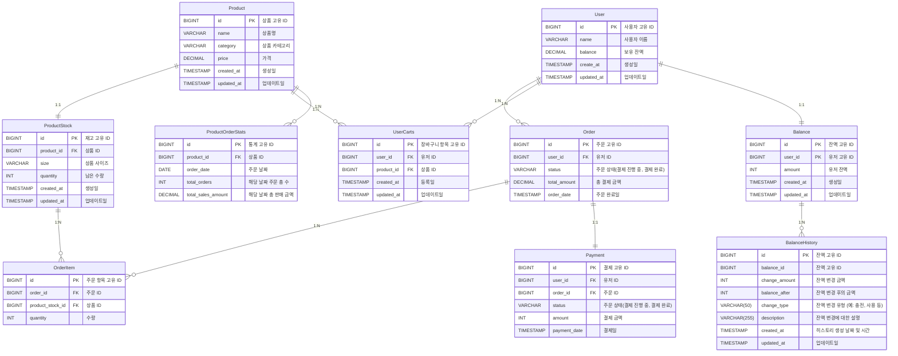

```mermaid
erDiagram

    User ||--o{ Order : "1:N"
    User ||--o{ UserCarts : "1:N"
    User ||--|| Balance : "1:1"
    Balance ||--o{ BalanceHistory : "1:N"
    ProductStock ||--o{ OrderItem : "1:N"
    Product ||--|| ProductStock : "1:1"
    Product ||--o{ UserCarts : "1:N"
    Product ||--o{ ProductOrderStats : "1:N"
    Order ||--o{ OrderItem : "1:N"
    Order ||--|| Payment : "1:1"
    
    User {
        BIGINT id PK "사용자 고유 ID"
        VARCHAR name "사용자 이름"
        DECIMAL balance "보유 잔액"
        TIMESTAMP create_at "생성일"
        TIMESTAMP updated_at "업데이트일"
    }
    
    Balance {
        BIGINT id PK "잔액 고유 ID"
        BIGINT user_id PK "유저 고유 ID"
        INT amount "유저 잔액"
        TIMESTAMP created_at "생성일"
        TIMESTAMP updated_at "업데이트일"
    }
    
    BalanceHistory {
        BIGINT id PK "잔액 고유 ID"
        BIGINT balance_id "잔액 고유 ID"
        INT change_amount "잔액 변경 금액"
        INT balance_after "잔액 변경 후의 금액"
        VARCHAR(50) change_type "잔액 변경 유형 (예: 충전, 사용 등)"
        VARCHAR(255) description "잔액 변경에 대한 설명"
        TIMESTAMP created_at "히스토리 생성 날짜 및 시간"
        TIMESTAMP updated_at "업데이트일"
    }

    Product {
        BIGINT id PK "상품 고유 ID"
        VARCHAR name "상품명"
        VARCHAR category "상품 카테고리"
        DECIMAL price "가격"
        TIMESTAMP created_at "생성일"
        TIMESTAMP updated_at "업데이트일"
    }

    ProductStock {
        BIGINT id PK "재고 고유 ID"
        BIGINT product_id FK "상품 ID"
        VARCHAR size "상품 사이즈"
        INT quantity "남은 수량"
        TIMESTAMP created_at "생성일"
        TIMESTAMP updated_at "업데이트일"
    }

    Order {
        BIGINT id PK "주문 고유 ID"
        BIGINT user_id FK "유저 ID"
        VARCHAR status "주문 상태(결제 진행 중, 결제 완료)"
        DECIMAL total_amount "총 결제 금액"
        TIMESTAMP order_date "주문 완료일"
    }

    OrderItem {
        BIGINT id PK "주문 항목 고유 ID"
        BIGINT order_id FK "주문 ID"
        BIGINT product_stock_id FK "상품 ID"
        INT quantity "수량"
    }
    
    Payment {
        BIGINT id PK "결제 고유 ID"
        BIGINT user_id FK "유저 ID"
        BIGINT order_id FK "주문 ID"
        VARCHAR status "주문 상태(결제 진행 중, 결제 완료)"
        INT amount "결제 금액"
        TIMESTAMP payment_date "결제일"
    }

    ProductOrderStats {
        BIGINT id PK "통계 고유 ID"
        BIGINT product_id FK "상품 ID"
        DATE order_date "주문 날짜"
        INT total_orders "해당 날짜 주문 총 수"
        DECIMAL total_sales_amount "해당 날짜 총 판매 금액"
    }

    UserCarts {
        BIGINT id PK "장바구니 항목 고유 ID"
        BIGINT user_id FK "유저 ID"
        BIGINT product_id FK "상품 ID"
        TIMESTAMP created_at "등록일"
        TIMESTAMP updated_at "업데이트일"
    }
```

