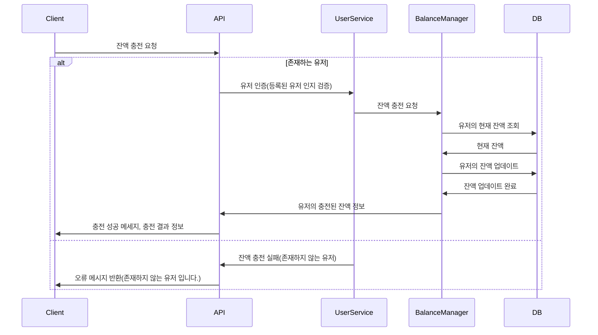
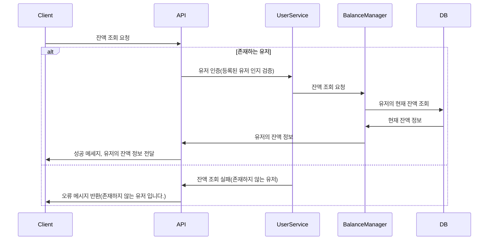
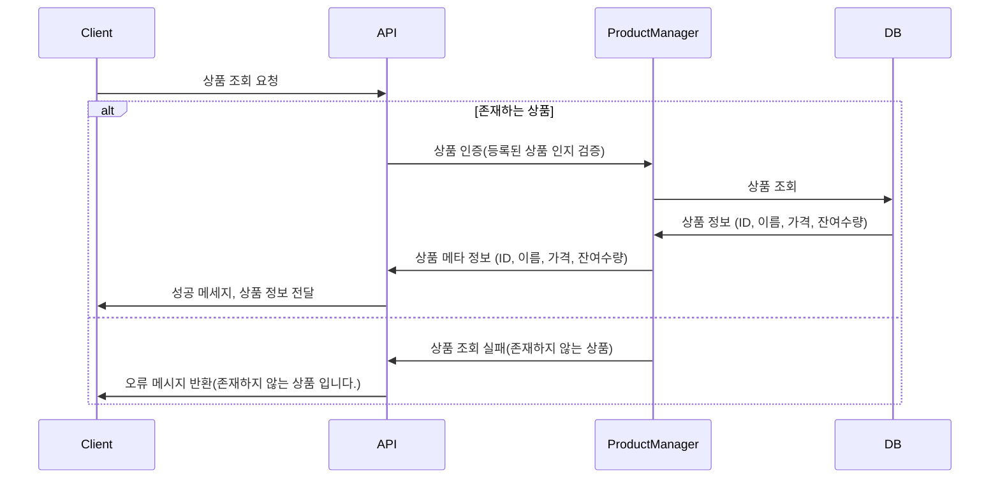
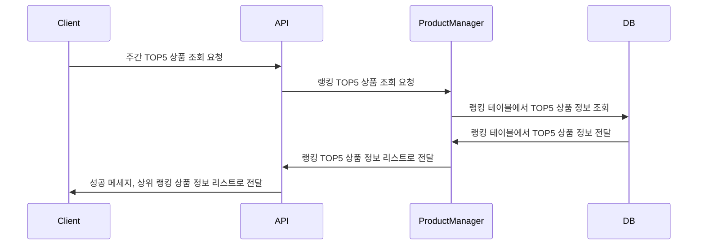
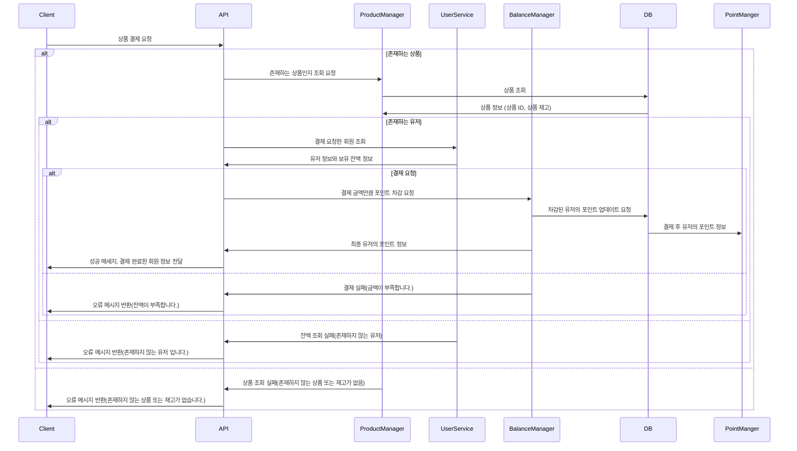
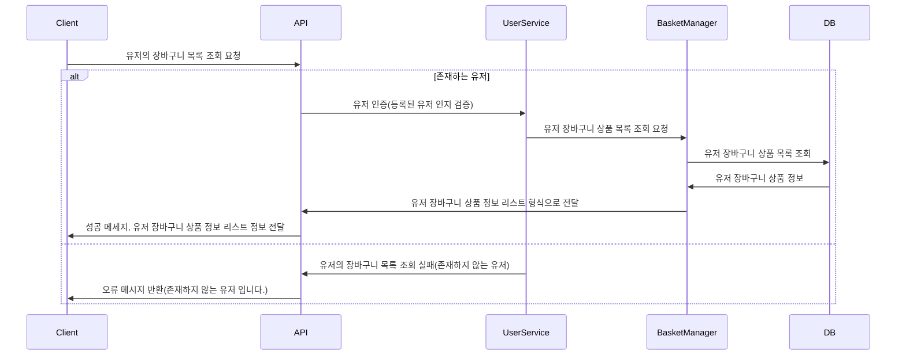
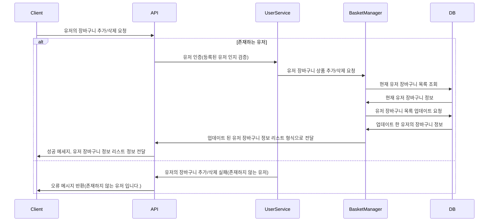

# 잔액 충전 API

### 이벤트 시퀀스

 

---
# 잔액 조회 API

### 이벤트 시퀀스

 

---

# 상품 조회 API

### 이벤트 시퀀스

 

---

# 상위 TOP5 상품 조회 API

### 이벤트 시퀀스

 

---

# 주문/결제 API

### 이벤트 시퀀스

 

---

# 장바구니 상품 조회 API

### 이벤트 시퀀스

 

---

# 장바구니 상품 추가/삭제 API

### 이벤트 시퀀스

  