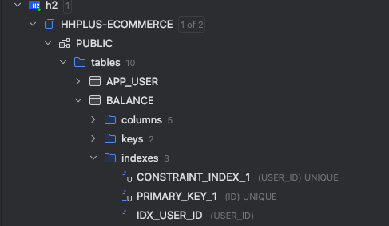
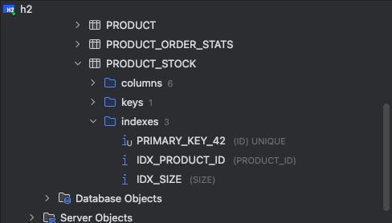

## Index 적용과 쿼리 성능개선 보고서

### 인덱스가 필요해 보이는 쿼리

1. 사용자 잔액 조회 쿼리

```kotlin
fun findByUserId(userId: Long): Balance?

select b.* from balance b where b.user_id = ?
```
`Index가 필요한 이유`
- 사용자별로 잔액 조회가 빈번하게 발생한다. (잔액 충전시, 상품 주문시 etc..)
- 다양한 비즈니스 로직에서 검증용으로 사용 된다.
  - 상품 주문시 잔액이 부족한지 검증 할 때 마다 사용
- 사용자 수가 많아 질수록 인덱스가 없다면 성능 저하 발생 가능성이 높다
- 따라서 user_id에 인덱스를 적용해서 조회 성능을 높인다.
  - user_id는 교유한 값이기 때문에 cardinality가 높다.

`Index 적용 방법`
```kotlin
@Entity
@Table(
    name = "balance",
    indexes = [Index(name = "idx_user_id", columnList = "user_id")]
)
class Balance(
    user: User,
    amount: Int,
): BaseEntity() {
    ...
}
```


### 인덱스 적용 후 효과

`성능 테스트`
테스트 환경에서 balance 테이블에 데이터를 대량으로 삽입하고 인덱스를 적용한 후 쿼리 성능을 확인해본 결과,
유의미한 성능 차이를 확인할 수는 없었습니다. 데이터의 양이 상대적으로 적은 상황에서는 인덱스 적용에 의한 성능 향상이 미미하게 
나타날 수 있으며, 실제로 성능을 크게 개선하기 위해서는 더 많은 데이터를 테스트에 사용해야 할 것으로 보입니다.

---

2. 상품 정보 조회 쿼리

`Index가 필요한 이유`
- ProductStock 테이블은 Product와 1 : N 관계를 맺고 있으며, 조회가 자주 발생하는 테이블입니다. 
특히 **product_id**와 size 필드는 자주 조회되거나 필터링 조건으로 사용될 가능성이 높습니다.
- 조회 성능 개선: ProductStock 테이블에서는 특정 상품(product_id)과 사이즈(size)에 대한 조회가 
빈번할 수 있습니다. 특히 대규모 상품 정보를 다루는 시스템에서 상품에 따른 재고량 조회는 필수적입니다.
- 1 : N 관계에서 자주 조회되는 product_id와 size 필드에 인덱스를 추가하면, 
특정 상품에 대한 상세 재고 정보 조회 시 성능 향상을 기대할 수 있습니다.
- product_id와 size는 자주 검색되는 값이므로 cardinality가 높아 인덱스를 통해 성능 개선을 실현할 수 있습니다.

`Index 적용 방법`
```kotlin
@Entity
@Table(
  name = "product_stock",
  indexes = [
    Index(name = "idx_product_id", columnList = "product_id"),
    Index(name = "idx_size", columnList = "size")
  ]
)
class ProductStock(
    ...
)
```


### 인덱스 적용 후 효과

`성능 테스트`
- 성능 테스트 테스트 환경에서 balance와 product_stock 테이블에 대량의 데이터를 삽입하고 인덱스를 적용하여 성능을 확인해본 결과, 
현재 데이터 양에서는 인덱스가 성능에 큰 영향을 주지 않았습니다.
- 이는 테스트 데이터의 양이 상대적으로 적기 때문이며, 실제로 데이터가 많아질 경우 인덱스를 통한 쿼리 최적화 효과가 나타날 가능성이 큽니다.

---
 
`결론`
- 현재 데이터 양에서는 인덱스 적용이 눈에 띄는 성능 차이를 보이지 않았습니다. 하지만, 사용자 수가 증가하고 데이터가 더 많이 쌓일 경우, 인덱스를 통해 성능 개선 효과를 기대할 수 있습니다.
- 인덱스는 SELECT 성능을 높일 수 있지만, UPDATE가 자주 발생하는 quantity 필드에 인덱스를 추가하지 않음으로써, 잦은 수정으로 인한 성능 저하를 방지할 수 있습니다.
- 실제 운영 환경에서 데이터와 트래픽이 증가할 경우, 인덱스 적용 효과가 더욱 두드러질 것입니다.