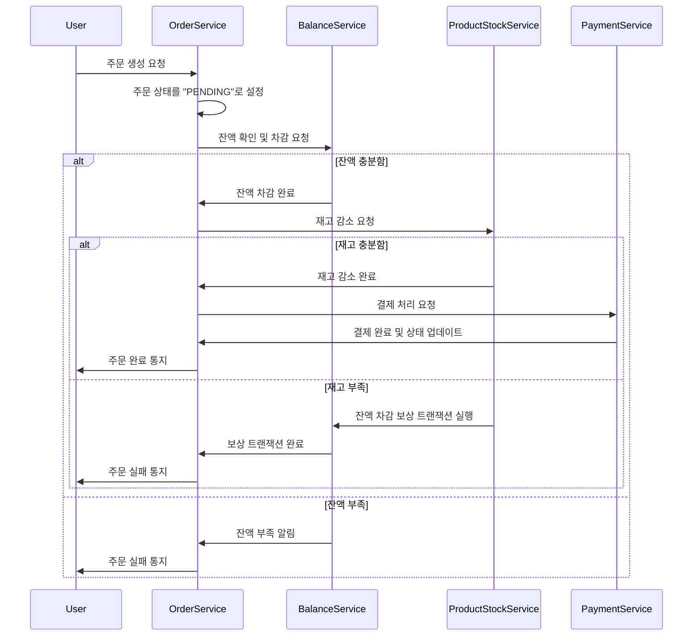

## MSA 변환
서비스 규모가 확장된다면 서비스를 어떻게 분리하고 그 분리에 따른 트랜잭션 처리 한계와 해결방안에 대한 설계 문서 작성을
해보겠습니다.

### 데이터 정합성 보장
OrderFacade에서 수행하는 productStockService, balanceService, orderService는 데이터베이스의 여러 테이블에 걸쳐 작업하므로, 
하나의 트랜잭션 내에서 이루어져야 합니다. 

예를 들어: 상품 존재 유효성 검증 후 재고 업데이트까지 한 트랜잭션으로 묶이지 않으면, 재고가 잘못 업데이트될 위험이 있습니다.
잔액 검증 후 주문 저장과 재고 감소가 일관되게 진행되지 않으면 주문이 성공해도 잔액이 부족한 상태가 발생할 수 있습니다.

### 분산 락(@DistributedRLock)과 트랜잭션 한계
현재 @DistributedRLock은 전체 프로세스에서 하나의 트랜잭션을 유지하지 못할 경우 트랜잭션과는 별개로 락을 통해 데이터 동시성 문제를 해결합니다. 
하지만 이는 락이 만료되거나 여러 서비스가 트랜잭션이 아닌 상태로 작동할 때 문제가 발생할 수 있습니다.

@DistributedRLock은 특정 기간 동안만 잠금을 유지할 수 있어, 처리 시간이 예상보다 길어지면 트랜잭션 충돌이나 데이터 불일치가 발생할 수 있습니다.
따라서 가능한 한 @Transactional로 묶어 원자성을 보장해주고, 분산 트랜잭션이나 비동기 메시징 큐 등을 활용해 트랜잭션 종료 후의 데이터 업데이트 또는 이벤트 처리를 설계하는 것이 좋습니다.

### MSA 환경에서의 트랜잭션 분할 설계
MSA로 전환할 경우, 트랜잭션을 한 호흡으로 관리하는 것이 어려워지므로 SAGA 패턴 같은 분산 트랜잭션 처리를 고려해야 할 것입니다. 

예를 들어: ProductStockService, BalanceService, OrderService를 각각 독립된 서비스로 분리한다면, 트랜잭션을 개별 서비스 수준에서 관리하기 어렵기 때문에 
SAGA 패턴을 통해 각 단계의 상태를 관리하고 실패 시 보상 조치를 취하는 방법을 사용해야 합니다.

따라서 현 구조에서는 @Transactional을 통해 원자성을 보장하는 것이 필수적이고, MSA 환경에서는 트랜잭션을 분할해 개별 서비스의 실패 시 보상 트랜잭션을 설계하는 방안을 적용해야 할 것입니다.

---
## 결제 로직 분석

### 주문 정보 조회 (findOrderById)
```kotlin
@Transactional
fun saveOrder(orderSaveDto: OrderSaveDto): OrderSaveResultDto {

    // 1. 상품 존재 하는지 조회
    val orderProducts = productStockService.valid(orderSaveDto.products)

    // 2. 유저 조회 - 유저 잔액 검증
    val userBalance = balanceService.getUserBalance(orderSaveDto.userId)
    userBalance.isEnoughMoney(orderSaveDto.totalAmount)

    // 3. 주문 정보 저장
    val result = orderService.save(orderSaveDto)

    // 4. 재고 정보 업데이트
    productStockService.updateStock(orderSaveDto.products)

    return result
}
```
현재 saveOrder 메서드는 트랜잭션 내에서 여러 단계의 작업을 수행하여 상품의 주문을 처리하고 있습니다. 
이 메서드에서 각각의 작업을 보면, 상품 유효성 검사, 잔액 검증, 주문 저장, 재고 업데이트의 순서로 이루어져 있습니다. 
각 단계는 다른 서비스에 의존하여 상호작용하며, 이들 작업이 원자성을 유지하지 않을 경우 데이터 불일치가 발생할 수 있습니다.

### MSA 분리의 한계와 해결 방안

`MSA 분리로 인한 트랜잭션 범위 축소`

현재의 모놀리틱 구조에서 saveOrder 메서드는 하나의 트랜잭션 안에서 유효성 검증부터 재고 업데이트까지를 보장합니다. 
하지만, MSA로 전환 시 각 서비스가 독립적으로 운영되므로 단일 트랜잭션으로 모든 작업을 관리하기 어려워집니다. 
예를 들어, ProductStockService, BalanceService, OrderService가 각각의 마이크로서비스로 분리된다면, 
트랜잭션 범위가 각 서비스로 분리되며, 한 번의 호출에 전체 작업의 원자성을 보장할 수 없게 됩니다.

`데이터 불일치 문제`

MSA 환경에서는 네트워크 지연이나 서비스 실패가 발생할 가능성이 높아지며, 각 서비스의 상태를 정확히 맞추기 어려운 경우가 발생할 수 있습니다.
예를 들어, 재고는 업데이트되었지만 잔액 차감이 실패하거나, 주문 저장이 완료되었으나 이후 단계가 실패할 수 있습니다. 
이는 주문 상태, 재고 정보, 잔액 정보 간 데이터 불일치 문제로 이어질 수 있습니다.

`해결 방안 - 분산 트랜잭션 패턴 (SAGA 패턴)`

이러한 한계를 해결하기 위해 SAGA 패턴을 적용하는 것이 효과적입니다. 
SAGA 패턴은 트랜잭션을 분산된 서비스 간에 단계별로 나누어 관리하고, 각 단계별로 보상 트랜잭션을 정의하여 실패 시 롤백이 아닌 
보상 조치를 통해 데이터를 일관성 있게 관리합니다.

예를 들어, 주문 생성이 성공했으나 잔액 차감이 실패한 경우, 주문을 취소하는 보상 트랜잭션을 통해 일관성을 유지할 수 있습니다.

`비동기 메시징 큐 활용`

또한, 메시징 큐를 통한 비동기 통신을 도입하여 각 서비스가 독립적으로 동작할 수 있게 하면서, 데이터 정합성을 유지할 수 있습니다. 
결제나 재고 업데이트와 같은 작업은 이벤트 기반으로 처리하여 서비스 간 결합을 낮추고, 
이벤트가 실패했을 경우 재시도 메커니즘을 추가하여 안정성을 높일 수 있습니다.

### SAGA 패턴 기반 설계

주요 서비스는 다음과 같이 구성됩니다.

- Order Service: 주문 생성, 주문 상태 관리
- Payment Service: 결제 처리, 결제 내역 관리
- Balance Service: 사용자 잔액 관리, 잔액 차감 및 검증
- Product Stock Service: 재고 관리, 재고 감소 처리

`SAGA 패턴의 단계별 처리 방식`
- SAGA 패턴은 주문 생성부터 결제, 잔액 차감, 재고 감소까지의 각 작업을 개별 트랜잭션으로 관리합니다. 
단계별로 서비스 간의 메시지를 비동기적으로 전달하여 각 단계가 성공적으로 완료되는지 확인합니다.
- 각 단계가 실패할 경우, 이전 단계의 성공한 트랜잭션에 대해 보상 트랜잭션을 실행하여 데이터의 일관성을 보장합니다.



`단계별 상세 설계`

OrderService
- 사용자의 주문 요청을 수신하고 주문 상태를 PENDING으로 설정합니다. 
- BalanceService에 잔액 확인을 요청합니다.

BalanceService
- 요청된 주문 금액에 대해 잔액을 확인합니다. 잔액이 충분하면 차감 후 OrderService에 완료를 알립니다.
- 잔액이 부족하면 OrderService에 잔액 부족을 알리고 주문을 종료합니다.

ProductStockService
- BalanceService로부터 잔액 확인이 완료된 후, OrderService는 재고 감소를 요청합니다.
- 재고가 충분하면 감소 후 완료를 알리고, 부족하면 BalanceService에 잔액 차감에 대한 보상 트랜잭션을 실행하도록 요청합니다.

PaymentService
- 모든 단계가 완료된 후 결제를 처리하고, 최종적으로 OrderService에 성공 여부를 알립니다.

보상 트랜잭션
- 재고 부족 시, BalanceService는 이전에 차감한 잔액을 복구하는 보상 트랜잭션을 실행하여 데이터 정합성을 유지합니다.
