## Swagger Api 문서 

[링크](http://localhost:8080/api-docs/swagger-ui/index.html)

---
## 전체 Api
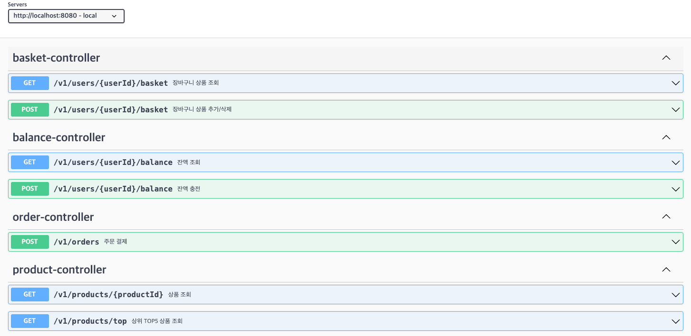

## Balance API

---
## 유저 잔액 조회
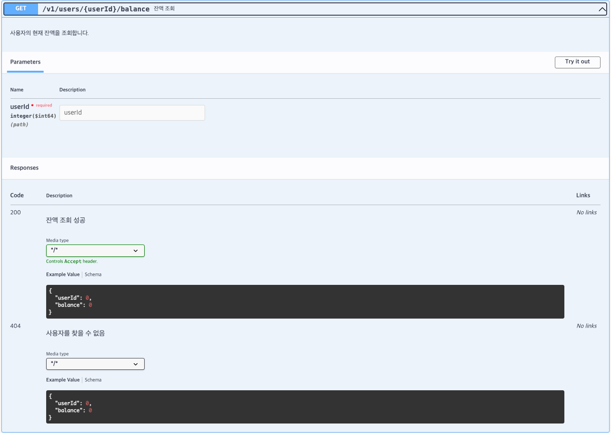

## 유저 잔액 충전
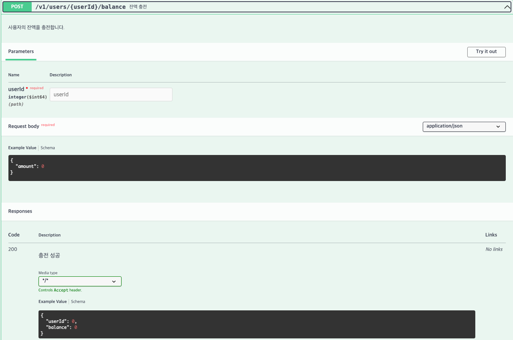

## PRODUCT API

---
## 상품 단건 조회
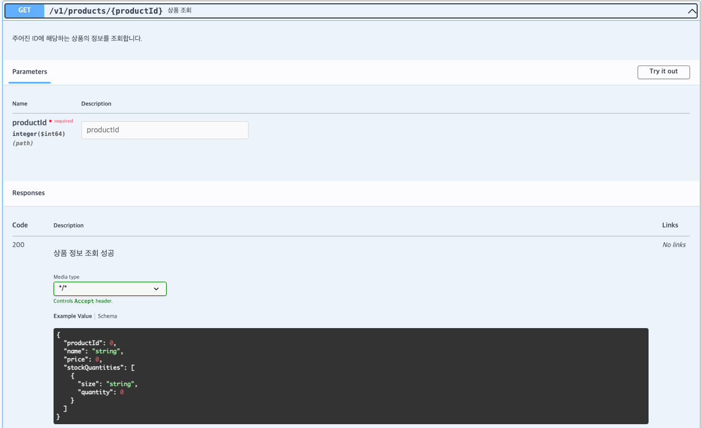

## 상품 전체 조회
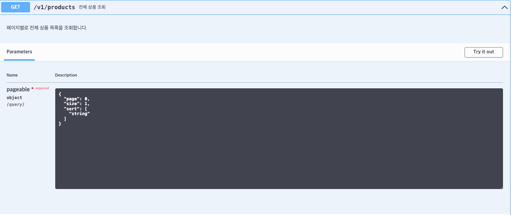
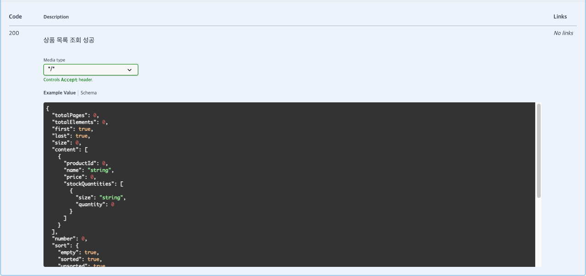

## TOP5 상품 조회
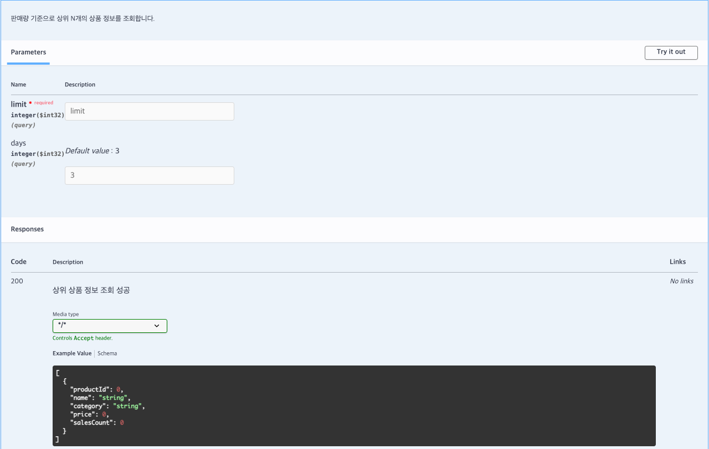

## ORDER API

---
## 주문 요청
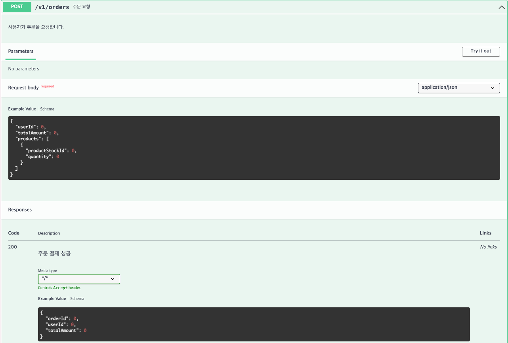

## PAYMENT API

---
## 결제 요청
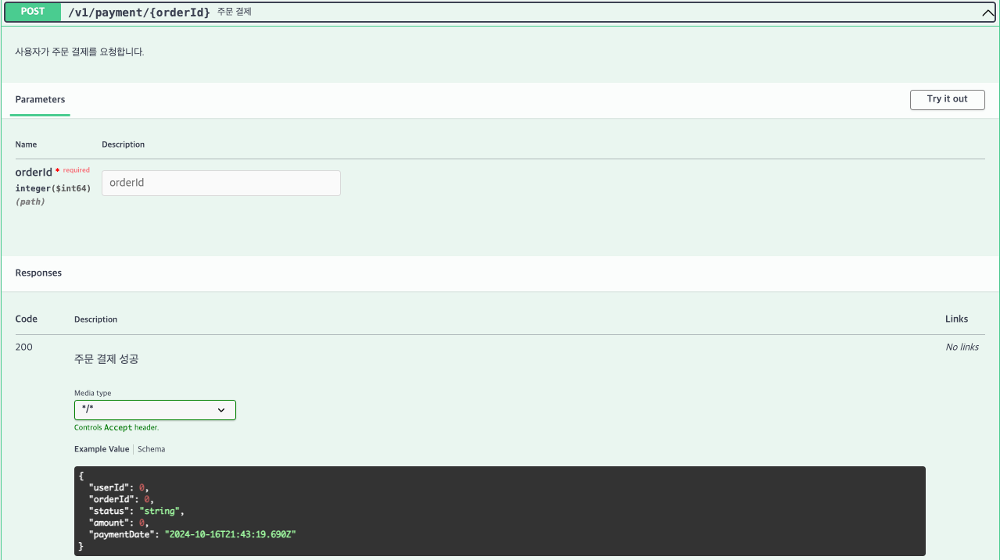

## CARTS API

---
## 장바구니 상품 조회
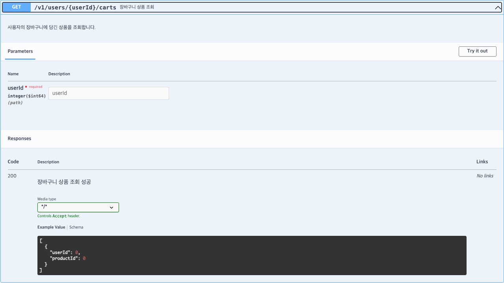

## 장바구니 상품 추가
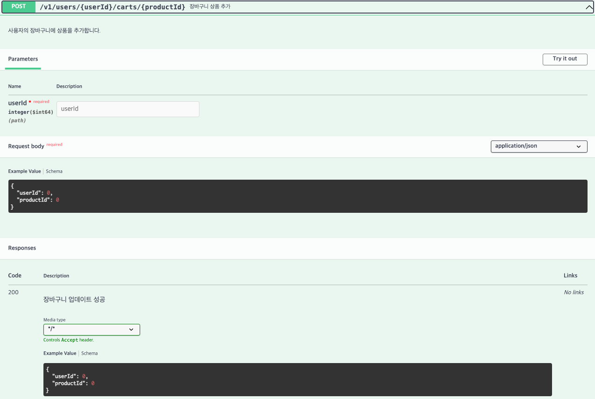

## 장바구니 상품 삭제
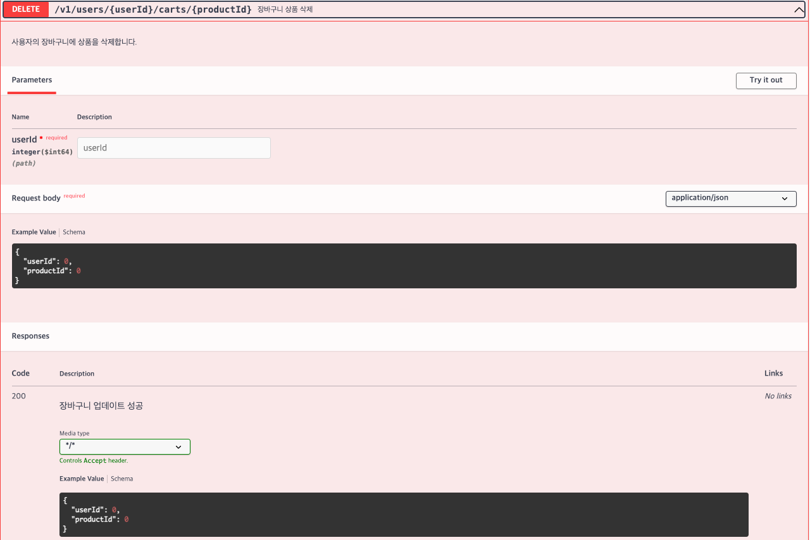

---

